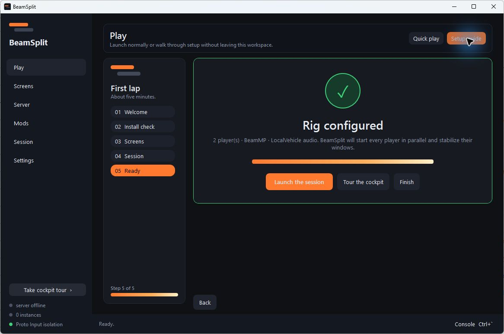
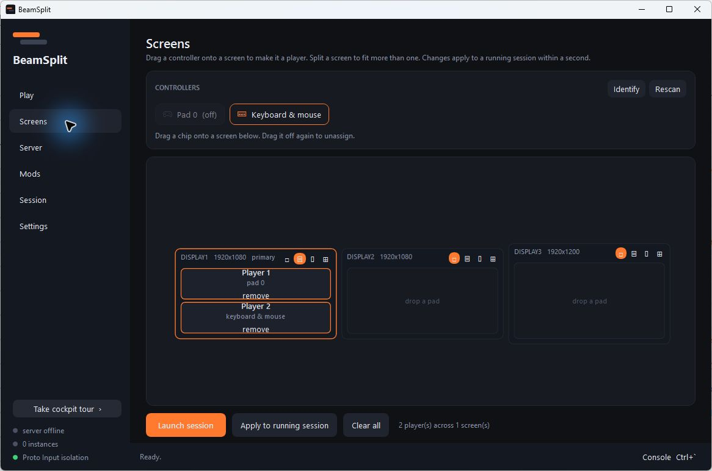
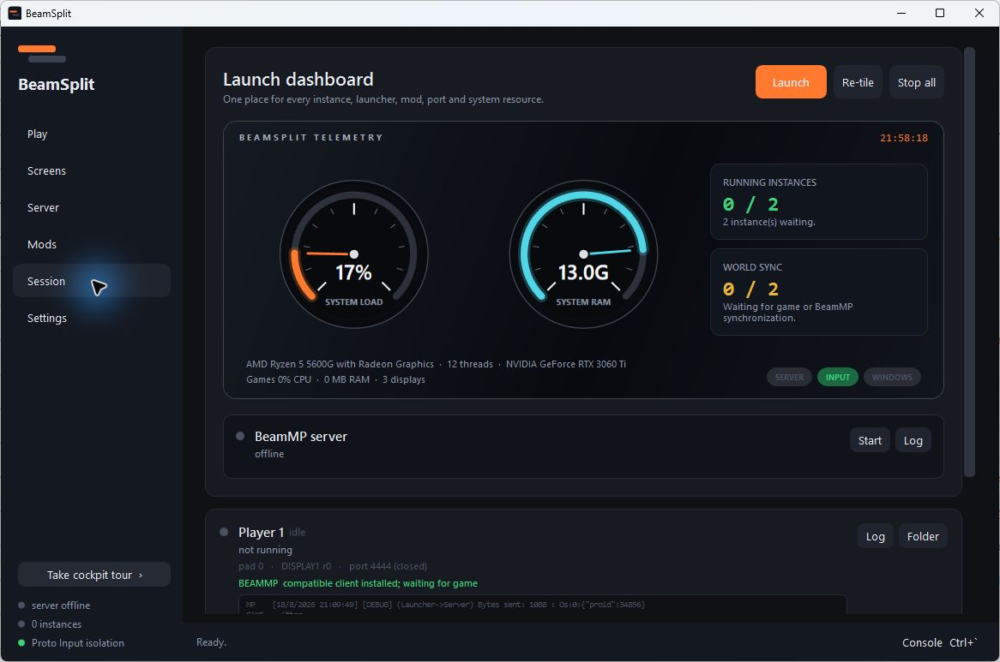

# BeamSplit

**Public beta · v1.8.1**

Local splitscreen for **BeamNG.drive** — two to four players on one PC, each on their
own screen (or their own slice of one), each with their own controller.

- **Solo** — every player gets an independent world. Any BeamNG version.
- **BeamMP** — everyone shares one world through a BeamMP server on your own machine.
- **Single instance (experimental)** — two offline players share one BeamNG process,
  map and simulation with native multiseat controls and independent camera views.

Portable `BeamSplit.exe`, nothing to install, no .NET or PowerShell needed. It doesn't
modify your BeamNG install; everything it creates lives in its own folders.

BeamSplit is an independent community project. It is not affiliated with or endorsed by
BeamNG GmbH, BeamMP, Valve, Nucleus Co-op, or the other projects it interoperates with.

BeamSplit is free software licensed under **AGPL-3.0-or-later**. Distributing a modified
copy requires making its corresponding source available under the same licence. Modified
versions offered to users over a network must offer those users their source as well.



<details>
<summary>More screenshots</summary>





</details>

---

## Start here

1. Run **`BeamSplit.exe`**. The first-run **Guide** walks through session type,
   players, prerequisites, screens, server and audio in a few short steps.
2. Let **Fix setup** repair the safe automatic items. Anything requiring your choice
   gets a direct button to the right screen.
3. Choose a screen preset, review the final summary, and launch. All player pipelines
   start in parallel.
4. Next time, use the redesigned **Play** dashboard: choose mode/players and launch;
   its readiness meter tells you what is missing before you wait.
5. BeamMP sessions guest-login and direct-connect themselves when the local server is ready.

First launch builds one game folder per player and BeamNG compiles shaders per profile,
so it's slow once. After that it's quick.

### Experimental single-instance mode

Choose **Single instance · experimental** on Play, configure exactly two inputs and
screen regions, then launch. BeamSplit opens one normal BeamNG window; choose a Freeroam
map inside BeamNG and the second vehicle, split views and per-player HUD activate when
the map finishes loading. Two-monitor layouts use one borderless window spanning the
chosen displays.

Multi-instance is always selected again when BeamSplit starts. Launching the experimental
engine shows a final warning and requires explicit confirmation; cancelling returns to
BeamSplit without starting or changing the session.

This mode is offline-only and deliberately version-gated. It uses camera-context and
render-view APIs shipped in newer BeamNG builds but not documented as a stable public
split-screen interface. If BeamSplit cannot find the required APIs, it leaves the game
untouched and asks you to use the stable multi-instance engine. The experimental engine
never uses Proto Input, XInput proxy DLLs, BeamMP launchers or the local BeamMP server.

### Requirements

- Windows 10/11 64-bit, BeamNG.drive, one XInput pad per player
- Shared world also needs BeamMP installed and a free AuthKey from
  <https://keymaster.beammp.com> — required even for a private LAN server
- ~500 MB disk per player

---

## Controllers and focus

Proto Input gives every controller instance a private XInput slot and simulated focus.
You can click a game, use its menus, and move focus between windows without the pads
merging. The older XInput proxy and devreorder remain deployed as fallback layers.

Controller-per-instance is the supported reliable arrangement. A keyboard player still
uses Windows' normal focused-keyboard path; BeamSplit does not yet split one keyboard
from the controllers independently.

---

## Tabs

**Setup** — the first-run guide plus the complete green/red system-readiness checklist,
automatic repairs and setup log. Incomplete installs open here; once onboarding is done,
BeamSplit opens directly on Play. You can return whenever an install path or game version
changes.

**Cockpit tour** — a reusable seven-stop walkaround over the real Setup, Play, Screens,
Server, Mods, Session and Settings pages. Start it from the lower-left **Take cockpit tour**
button; it explains what every screen is for without changing the rig.

**Play** — the session composer: choose the stable multi-instance or experimental
single-instance engine, BeamMP or Solo, one to four players, a quick
screen preset, controller isolation, shared mods, background audio, BeamMP audio mix,
frame cap, auto-join and launch cinematic from one page. Its compact readiness meter
links back to Setup if anything blocks launch; custom placement remains on Screens.

**Screens** — a map of your actual displays in Windows display-number order. Split any screen 1 / 2 stacked /
2 side-by-side / 4, drag pads onto regions, hit **Identify** if you're not sure which
pad is which. Layout buttons retile running games immediately, and **Apply to running
session** pushes both pads and placement live. The map
re-renders if you plug or unplug a display.

**Server** — the BeamMP server settings (name, port, players, cars, map, AuthKey).

**Mods** — includes a built-in browser for the official
[BeamNG repository](https://www.beamng.com/resources/), with local filtering, sorting,
pagination, download progress and one-click installation. Those downloads are ZIP-checked,
stored under BeamSplit's managed data folder, and zero-copy linked into every profile;
the browser never asks for BeamNG forum credentials. Your existing BeamNG `mods\repo`
library remains separate and read-only in intent. Per-package checkboxes choose the
optional BeamMP server pack copied into `Resources\Client`. BeamSplit tracks those server
files, so hand-installed packages and the pinned BeamMP client are left alone. Restart a
running server after changing its pack.

**Session** — the launch dashboard opens automatically and replaces the loose launcher
terminals. Its two car-style gauges show whole-system load and RAM; compact cards show
running instances and world sync. Driver cards show ports, controllers, per-process CPU/RAM, BeamMP client
health, and launcher/game log previews. Live state:
`Idle → Building → Launching → Waiting for launcher → Game running → Connected → Synced`.
A failing card names the actual missing signal — e.g. *connected to the launcher, not
synced into the world* — instead of a generic error.

Launch begins behind a skippable borderless-fullscreen film while every instance pipeline
runs in parallel. One beam splits into a live pane for each player, the panes pulse with
their individual launch progress, then resolve into the actual monitor and screen-region
layout when every game window has been created, tiled and stabilized. The film can sustain
indefinitely on a cold launch and resolves immediately when the real work finishes. The
entire launch pipeline runs off the UI thread and console updates stay below render priority,
so blocked process calls and output bursts cannot stop the sustain-loop motion. Disable it
or preview it safely under Settings → Session behaviour.

In BeamMP mode, each instance automatically requests guest login and Direct Connects to
`127.0.0.1` on the port in `ServerConfig.toml` as soon as its launcher is authenticated.
There is no Multiplayer/login/Direct Connect menu routine to repeat. Disable **Automatically
guest-login and join the local BeamMP server** under Settings → Session behaviour if you
want to choose a different server manually.

**Console** (`Ctrl+\``) — app, server and every instance's logs in one place, with source
filters, search, redacted **Copy diagnostics**, and **Create support bundle**. There's a command bar too:
`launch 2 · stop · retile · park · assign 0 1 · server start|stop · logs · guard`.

---

## How it works

| Piece | Approach |
|---|---|
| Separate profile | `<instance>\game\startup.ini` → its own userpath |
| Separate game folder | junctions for content, hardlinks for root files, real copy of `Bin64` only |
| Separate controller | Proto Input XInput/focus hooks, plus devreorder and the XInput proxy as fallbacks |
| Separate BeamMP port | one launcher per instance, ports spaced by 2 |
| Window placement | `SetWindowPos`, borderless, per monitor or per region |

It forces every profile to windowed mode, keeps audio/input alive in the background,
disables BeamNG's special background limiter, and applies the configurable session cap:

```
AudioMuteOnWindowLoseFocus  true  -> false
unfocusedInput              false -> true
GraphicDisplayModes         *     -> Window
fpsLimitEnabled             *     -> true
fpsLimit                    *     -> 60 (default)
fpsLimitBackgroundEnabled   *     -> false
fpsLimitBackground          *     -> 60 (fallback if re-enabled)
```

**Version matching (BeamMP).** The BeamMP launcher always downloads the *newest* client,
which silently deactivates itself on an older BeamNG — you get no Multiplayer button.
BeamSplit lets the launcher complete its update pass, then installs the release built
for *your* game version immediately before BeamNG starts. Starting a new session first
stops only processes under BeamSplit's instance folder, preventing stale launchers from
holding ports or replacing one player's compatible client.

---

## Troubleshooting

**Both pads drive one car** — Settings → Input isolation should have **Proto Input**
enabled, and Play should show Proto Input as installed. Stop and relaunch after changing
input settings. The Console should say `Proto Input pad N, fake focus` for every player.

**The unfocused instance runs at only a few FPS** — Stop every BeamNG instance and
start a fresh BeamSplit session so the background-throttle fix can be written to both
profiles. The Console should say `background throttle off` and `Proto Input pad N,
fake focus` for every player. A warning instead means the profile is locked or
read-only. Also disable any GPU-driver feature named *Background Application Max Frame
Rate*, *Radeon Chill*, or equivalent for BeamNG.

**No Multiplayer button** — client/game version mismatch. Setup → *BeamMP client version*
→ Fetch.

**Server won't start** — it needs an AuthKey even privately. Setup → *Server AuthKey*.

**Connected but players can't see each other** — the Session card will say
*not synced into the world yet*. Usually resolves on its own; if not, Stop and relaunch.

**An instance dies instantly with no log, or "DLL was not found"** — antivirus quarantined
a game file while the instance was being copied. BeamSplit warns about this during the
build. Add an exclusion for your instances folder and the game folder, then rebuild.

**Wrong game launches** — if you have more than one BeamNG install, Setup says so. Pick
the right one on Settings.

Logs and config: `%LOCALAPPDATA%\BeamSplit`.

For reproducible reports, create a redacted support bundle from the Console and follow
[SUPPORT.md](SUPPORT.md). Compatibility and honest known limits are tracked in
[docs/COMPATIBILITY.md](docs/COMPATIBILITY.md). See [PRIVACY.md](PRIVACY.md),
[SECURITY.md](SECURITY.md), and [THIRD-PARTY.md](THIRD-PARTY.md) before distribution.

---

## Portable updates

Settings → **BeamSplit updates** checks the official GitHub release channel. BeamSplit
downloads only a release asset named `BeamSplit.exe`, `BeamSplit-portable.zip`, or
`BeamSplit.zip`, verifies the SHA-256 digest supplied by GitHub, keeps the previous EXE
as `BeamSplit.exe.previous`, and restarts in place. Config, profiles and instances are
not replaced.

The release repository and release must be public for unauthenticated installs. An
update without GitHub's SHA-256 digest is shown but will not be installed automatically.

Tagged builds are produced by the public Windows workflow, accompanied by SHA-256 hashes
and GitHub provenance attestations. Public releases should also carry a trusted Windows
code signature; unsigned test builds must be labelled as such.

## Licence

BeamSplit application code and its native input helpers are licensed under
[`AGPL-3.0-or-later`](LICENSE). Redistributed dependencies retain their own licences and
notices in [`THIRD-PARTY-NOTICES.txt`](THIRD-PARTY-NOTICES.txt). BeamMP and devreorder
are downloaded separately and remain governed by their respective projects.
